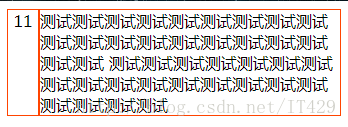

# 实现效果


# 实现代码
HTML：
```HTML
<div class="ctn>
    <div id="left">11</div>
    <div id="right">
      测试测试测试测试测试测试测试测试测试测试测试测试测试测试测试测试测试测试测试测试测试测试测试测试测试测试测试测试测试测试测试测试测试测试测试测试测试测试测试测试
    </div>
</div>
```

CSS:
```CSS
.ctn{
    display: -webkit-box;
}
.left, .right {
    border: 1px solid red;
}
```

# 相关文章
此文章是通过纯css设置，此外还可以使用js实现，[点此进入查看](../javascript/两个div并排,使高度一致.md)。
