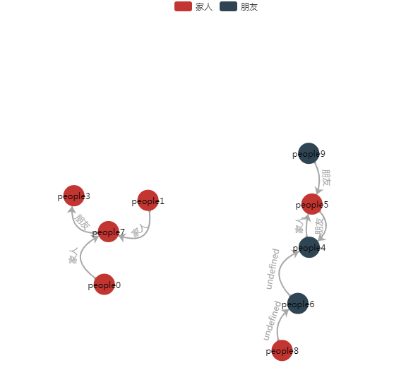

<!-- TOC depthFrom:1 depthTo:6 withLinks:1 updateOnSave:1 orderedList:0 -->

- [效果图](#效果图)
- [代码解析](#代码解析)
- [总结](#总结)

<!-- /TOC -->

# 效果图


# 代码解析
```javascript
var categories = [{
   name: '家人',
   itemStyle: {
       normal: {
           color: "#c23531",
       }
   }
},
{
   name: '朋友',
   itemStyle: {
       normal: {
           color: "#2f4554",
       }
   }
}];

var legend = ["家人", "朋友"];
var peoples = [],
    linkes = [];

//关系网数据
for (var i = 0; i < 10; i++) {
   peoples.push({
       name: i,
       draggable: true,
       displayname: 'people' + i,
       category: Math.floor(Math.random() * 3)
   });
};
//数据之间的关系
for (var i = 0; i < 10; i++) {
   linkes.push({
       source: i,
       target: Math.floor(Math.random() * 10),
       value: legend[Math.floor(Math.random() * 3)],
       lineStyle: {
           normal: {
               color: '#a7a7a8',
               curveness: Math.random() * 1 // 线的弯曲度 0-1之间 越大则歪曲度更大
           }
       },
       label: {
           normal: {
               textStyle: {
                   color: '#a7a7a8',
                   fontSize: 12
               }
           }
       }
   });
};

var option = {
   backgroundColor: '#fff',
   tooltip: {
       show: true,
       formatter: function(e) {
           return e.data.displayname;
       }
   },
   legend: {
       x: "center",
       data: legend,
       tooltip: {
           show: true
       },
   },
   animationDurationUpdate: 1500,
   animationEasingUpdate: 'quinticInOut',
   series: [{
       categories: categories,
       type: 'graph',
       layout: 'force',
       symbol: "circle",
       symbolSize: 30,
       roam: true, //禁止用鼠标滚轮缩小放大效果
       edgeSymbol: ['circle', 'arrow'],
       edgeSymbolSize: [4, 10],
       // 连接线上的文字
       focusNodeAdjacency: true, //划过只显示对应关系
       edgeLabel: {
           normal: {
               show: true,
               textStyle: {
                   fontSize: 12
               },
               formatter: "{c}"
           }
       },
       lineStyle: {
           normal: {
               opacity: 1,
               width: 2,
               curveness: 0
           }
       },
       // 圆圈内的文字
       label: {
           normal: {
               show: true,
               formatter: function(e) {
                   return e.data.displayname;
               },
               textStyle: {
                   color: '#000',
                   fontFamily: '微软雅黑',
                   fontSize: 12
               }
           }
       },
       force: {
           repulsion: 500
       },
       data: peoples,
       links: linkes,
   }]
};

myChart.on('click', function(params) {
   if (params.dataType === "node") {
       alert(params.data.displayname)

   }
});
```

# 总结
要生成关系网最重要就是2个数据，一个peoples一个linkes。peoples是所有的关系网数据，linkes是这个关系网数据的关系。
