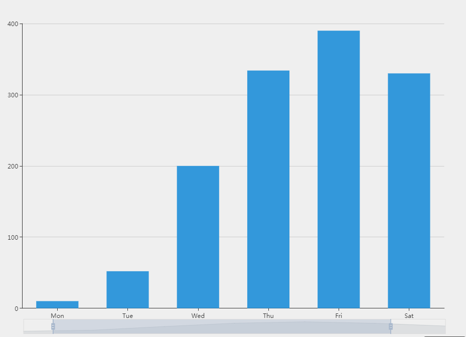

# 例子


# 起效代码
```javascript
  dataZoom: [
    {
      show: true,
      height: 30, //区域缩放的高度
      bottom: 10, //离底部距离
      start: 0,   //在哪开始 0-100间
      end: 100,   //在哪结束 0-100间
      backgroundColor: '#1a3364',  //区域缩放条的背景色
      fillerColor: '#154981',      //区域缩放条选中的填充颜色
      borderColor: 'transparent',  //区域缩放条边框色
      handleStyle: {               //区域缩放条的样式
        color: '#01a0f1'
      }
    }
  ]
```
