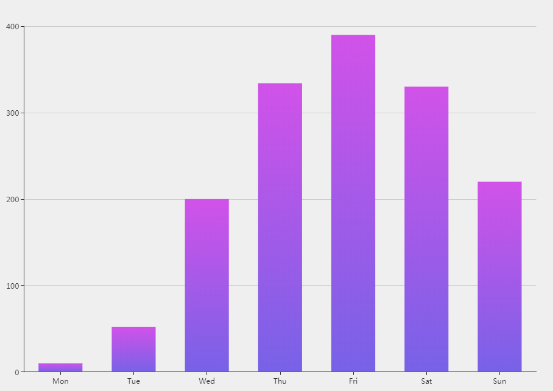

# 样例


# 起效代码
```javascript
  series: [{
    name: 'XXX',
    type: 'bar',
    data: [0,10,20,30,20,10,9],

    itemStyle: {
      normal: {
        color: new echarts.graphic.LinearGradient(0,0,0,1,[
          {offset: 0, color: '#d152e9'},
          {offset: 1, color: '#7762e7'}
        ])
      }
    }
  }]
```
