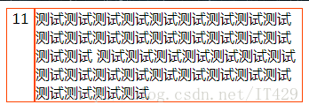

# 实现效果


# 实现代码
HTML：
```HTML
<div class="ctn>
    <div id="left">11</div>
    <div id="right">
      测试测试测试测试测试测试测试测试测试测试测试测试测试测试测试测试测试测试测试测试测试测试测试测试测试测试测试测试测试测试测试测试测试测试测试测试测试测试测试测试
    </div>
</div>
```

js:
```javascript
$(function(){
    var heightLeft= $("#Left").height();
    var heightRight= $("#Right").height();
    if (heightLeft > heightRight) {
          $("#right").height(heightLeft);
    } else {
         $("#left").height(heightRight);
    }
});
```

# 相关文章
此文章是使用js通过height()设置，此外还可以通过纯css实现，[点此进入查看](../css/两个div并排,使高度一致.md)。
