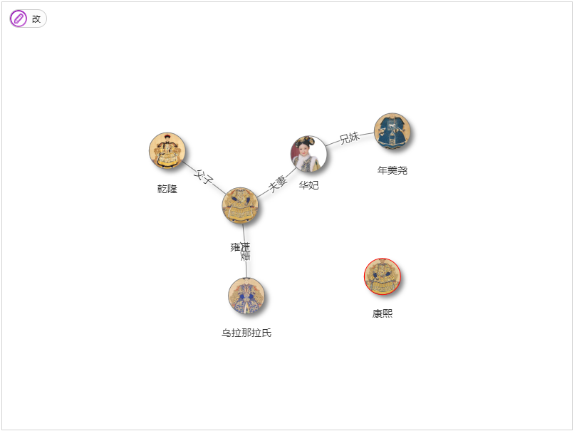

# 概述

关系网Network是一个可视化显示网络和网络节点和边组成。可视化是易于使用和支持自定义形状,款式,颜色,尺寸,图片,等等。网络可视化工作顺利在任何现代浏览器几千节点和边。处理大量的节点,网络集群支持。网络使用HTML画布上呈现

# 效果展示



# html+css代码

```html
<style>
#mynetwork {
 width: 800px;
 height: 600px;
 margin: 0 auto;
 border: 1px solid lightgray;
}
</style>
<div id="mynetwork" ondrop="drop(event)" ondragover="allowDrop(event)"></div>
```

# js关键代码

```javascript
<script src="../jquery.js"></script>
<script src="vis-4.21.0/dist/vis.js"></script>
<script>
		// create an array with nodes
		var nodes = new vis.DataSet([
		    {id: 1, label: '雍正', shape: 'circularImage', image: 'imgs/yz.jpg', color: 'grey'},
		    {id: 2, label: '乾隆', shape: 'circularImage', image: 'imgs/ql.jpg', color: 'grey'},
		    {id: 3, label: '华妃', shape: 'circularImage', image: 'imgs/hf.jpg', color: 'grey'},
		    {id: 4, label: '年羹尧', shape: 'circularImage', image: 'imgs/ngy.jpg', color: 'grey'},
		    {id: 5, label: '乌拉那拉氏', shape: 'circularImage', image: 'imgs/wlnls.jpg', color: 'grey'}
		]);

		// create an array with edges
		var edges = new vis.DataSet([
		    {from: 1, to: 3, label: '夫妻', font: {align: 'middle'}},
		    {from: 1, to: 2, label: '父子', font: {align: 'middle'}},
		    {from: 3, to: 4, label: '兄妹', font: {align: 'middle'}},
		    {from: 1, to: 5, label: '夫妻', font: {align: 'middle'}}
		]);

		// create a network
		var container = document.getElementById('mynetwork');
		var data = {
		    nodes: nodes,
		    edges: edges
		};
		var options = {
			autoResize: true,
			locale: 'cn',
		    locales: {
		        cn: {
		            edit: '修改',
		            del: '删除选定',
		            back: '返回',
		            addNode: '添加节点',
		            addEdge: '添加关联',
		            editNode: '编辑节点',
		            editEdge: '编辑关联',
		            addDescription: '单击空白处来放置一个新节点。',
		            edgeDescription: '单击一个节点并拖动到另一个节点以连接它们。',
		            editEdgeDescription: '单击控制点并将其拖动到节点以连接到它。',
		            createEdgeError: '无法将边缘链接到集群。',
		            deleteClusterError: '不能删除集群。',
		            editClusterError: '不能编辑集群。'
		        }
		    },
	        nodes: {
	            borderWidth: 2,
	            shadow:true
	        },
	        edges: {
	            width: 1,
	            shadow:true
	        },
			interaction: {hover:true},
			manipulation: {
          enabled: true,
      }
		};

		var network = new vis.Network(container, data, options);

	</script>
```
