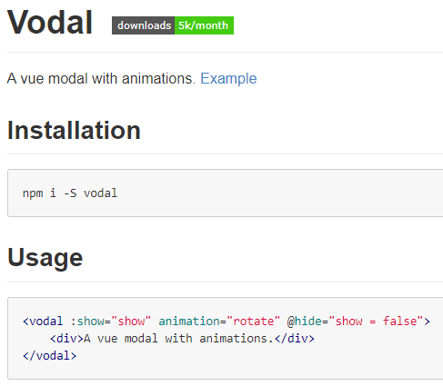
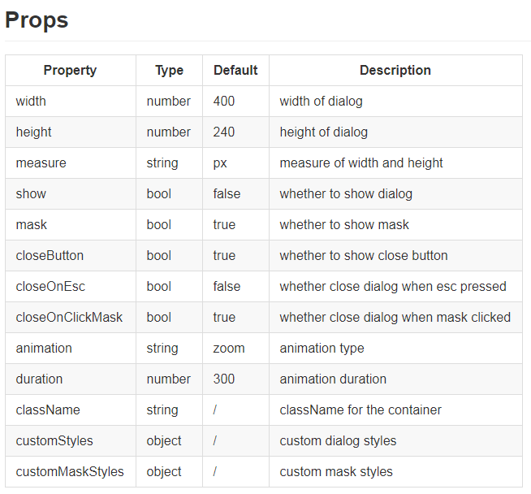
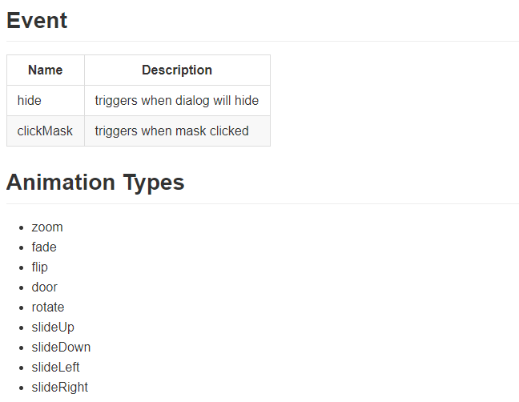

<!-- @import "[TOC]" {cmd="toc" depthFrom=1 depthTo=6 orderedList=false} -->
<!-- code_chunk_output -->

* [概述](#概述)
* [属性](#属性)
* [方法和动画](#方法和动画)

<!-- /code_chunk_output -->

# 概述
elementUI 已经有弹框dialog, 但是这个dialog在不可见(:visible.sync="false")的情况下在dom里是找不到的, 有时后我们要在弹框里显示地图或图表，这些在打开弹框前都是需要提前知道宽高才能加载的，dialog明显不能满足这个需求，所以我们可以采用另一种弹框-----vodal, 可以在淘宝镜像里找到它。
https://npm.taobao.org/package/vodal

# 属性

# 方法和动画

