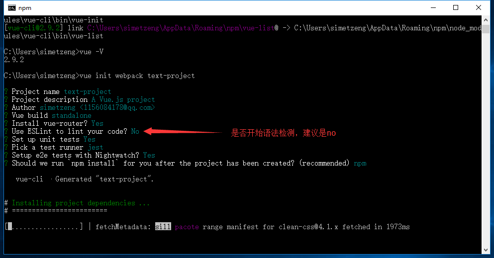

# 概述
Vue-cli是快速构建这个单页应用(vue)的脚手架。

# 安装前准备
1. 安装node.js：
  - 安装链接: https://nodejs.org/en/ ，下载完成后傻瓜式安装.
  - 验证成功：打开cmd ---> 输入node -v ---> 回车 ---> 出现了node的版本就表明安装成功了

2. 安装淘宝镜像(可跳过)：
  - 上一步安装完成的node是自带npm(包管理工具)的，但是这个npm的服务器是外国的, 所以后续在安装依赖的时候速度是很慢的, 这时我们就可以安装cnpm来提升速度, 网速快的朋友也可以跳过这一步
  - 打开cmd ---> 输入：npm install -g cnpm --registry= https://registry.npm.taobao.org ---> 回车 ---> 安装完成后输入：cnpm -v ---> 出现相应的版本号即安装成功

 3. 安装webpack：
  - 打开cmd ---> 输入：cnpm install webpack -g ---> 回车 ---> 安装完成后输入：webpack -v ---> 出现相应的版本号即安装成功

 4. 安装Vue-cli脚手架构建工具
  - 打开cmd ---> 输入：cnpm install vue-cli -g ---> 回车 ---> 安装完成后输入：vue -V ---> 出现相应的版本号即安装成功

# 构建项目
以上几个步骤完成后, 我们需要的环境和工具就已经准备好了。现在我们开始使用vue-cli来构建项目。

1. 安装脚手架，在cmd ---> 输入： vue init webpack projectName
  
2. cd命令进入项目的路径
3. 安装项目依赖：npm install。这里注意不要用cnpm，因为从国内镜像安装会导致后面会缺少很多依赖库
4. 安装vue路由模块(vue-router)和网络请求模块(vue-resource)，cnpm install vue-router vue-resource --save
5. 启动项目，输入npm run dev

# 引入jquery
cmd到当前项目的路径
→ 运行 `cnpm install --save jquery`
→ 在build文件夹下面找到 `webpack.base.conf.js` 文件
→ 加入 `const config = require('../config')`
→ 在module.exports的最后加入
```
plugins: [
    new webpack.optimize.CommonsChunkPlugin('common.js'),
    new webpack.ProvidePlugin({
      jQuery: "jquery",
      $: "jquery"
    })
  ]
```
 → 最后重新`cnpm run dev`就可以了

# 引入less
cmd到当前项目的路径
→ 运行 `cnpm less less-loader --save jquery`
→ 在build文件夹下面找到 `webpack.base.conf.js` 文件
→ 在 `module.exports` 对象的 `module.rules` 后面添加一段
```
rules: [
  {
    test: /\.less$/,
    loader: "style-loader!css-loader!less-loader",
  }
]
```
→ 最后在style标签中加上 `lang="less"` 即可(Tips：style标签上的scoped代表以下的css样式只在当前页面有效)
