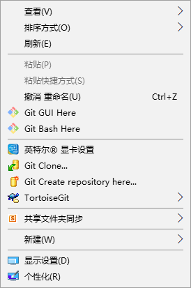

# 概述
Git是一个开源的分布式版本控制系统，可以有效、高速的处理从很小到非常大的项目版本管理。

# 下载安装
* 下载地址：https://git-scm.com/downloads
* 安装：按默认选择安装就行了，傻瓜式安装直接点击下一步下一步即可完成。
* 判断是否安装成功：在开始菜单找到Git--->Git Bash，点击会弹出类似命令窗口就说明安装成功了。

# Git图形化工具
我只使用过2款git图形化工具，这2款也是比较火的，所以这里就只给大家介绍我用过的2款：
* TortoiseGit(传说中的小乌龟)：这是我最喜欢用的图形化工具，小乌龟支持中文版，但这款工具目前只提供Windows版本。(官方网站：https://tortoisegit.org/)
* Source Tree：这款工具我用下来的体验是界面美观，功能也很丰富，非常适合新手上手。(官方网站：https://www.sourcetreeapp.com/)

git和tortoise都安装完成后，在桌面右键会如下图所示：

这里稍微说一下，大家要先安装Git然后才安装TortoiseGit(不要问我为什么会说出这么傻x的话，因为我就干过这种事)重装系统后我忘记我有没有安装git了，直接就安装TortoiseGit！在安装的时候它会让我选择安装git的路径，我才发现我没装git，然后才去装git，但是当我去clone项目的时候总是不成功。最后我把这2货卸载重新安装才成功。

